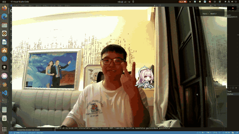

# Interactable Agentferry / Amearth Camera Pet

> **Linux desktop pet driven by your webcam.** It tracks your face, recognises six
> MediaPipe gestures plus a custom pinch, and reacts with GIFs, voice lines,
> and background music. The pet's size adapts to your distance, and dragging
> it (mouse or pinch) makes it fly back to your head on release.
>
> 打开摄像头，桌宠会跟着你的脸飞过来；比个手势，它会用动画 / 语音 / 音乐回应你。



---

<p align="center">
  <a href="LICENSE"></a>
  
  
  
  
  
</p>

---

## ✨ Features

| Capability | What it does |
|---|---|
| **Face tracking** | Pet flies to a point around your head (keeps a 20% margin so it doesn't overlap your face). |
| **Distance tiers** | Pet grows when you lean in, shrinks when you move away (three tiers based on face-bbox width). |
| **6 MediaPipe gestures** | `Open_Palm` / `Thumb_Up` / `Thumb_Down` / `Victory` / `Closed_Fist` / `Pointing_Up` — each maps to a unique GIF + (some) voice line. |
| **Custom pinch** | Thumb + index finger pinch to drag the pet; release (or open your palm) to release. |
| **Mouse drag** | Click and drag the pet; release sends it flying back. |
| **Selfie-mode flip** | Horizontal flip toggle in Settings (default on) so the preview matches your mirror image. |
| **HUD overlay** | Top-right badge shows the current gesture + face / hand detection status. |
| **Settings dialog** | Right-click → Settings: flight speed, distance thresholds, pet scale per tier, camera flip. Persists to `~/.config/interactable_agentferry/settings.json`. |
| **Hotkeys** | `Esc` quits. |

---

## 📸 Gesture cheat sheet

| Gesture | Reaction | Voice / Music |
|---|---|---|
| 🖐️ `Open_Palm` | Flies to your palm, cycles idle1~4 | — |
| 👍 `Thumb_Up` | Plays `screen1.gif` | — |
| 👎 `Thumb_Down` | Plays `screen4.gif` | "嘿嘿.wav" |
| ✌️ `Victory` | Plays `ameath.gif` | "现实系统，侵入完成.wav" + random MP3 |
| ✊ `Closed_Fist` | Plays `screen2.gif` | — |
| ☝️ `Pointing_Up` | Plays `screen3.gif` | — |
| 🤏 `Pinch` (thumb + index) | Enters drag mode, pet follows your fingers | "嘿嘿.wav" on release |

---

## 🖥️ System requirements

| Item | Requirement |
|---|---|
| OS | **Ubuntu 22.04 LTS** (other distros untested) |
| Window system | **X11** (Wayland not tested) |
| Python | 3.10 – 3.12 |
| RAM | ≥ 8 GB recommended |
| GPU | Optional — NVIDIA RTX 4060 tested, smooth; pure CPU works at reduced FPS |
| Camera | Any V4L2-compatible device (built-in laptop, USB, etc.) |

---

## 🚀 Quick start

### 1. Clone & install

```bash
git clone https://github.com/Yuxin-Luo/Interactable_Agentferry.git
cd Interactable_Agentferry
python3 -m venv .venv
source .venv/bin/activate
pip install -r requirements.txt
pip install -e .           # registers the src/ package so the entrypoint works
```

### 2. Download MediaPipe models (one-time)

```bash
bash scripts/download_models.sh
```

This pulls four models (~19 MB total) into `assets/models/`:

| Model | Purpose |
|---|---|
| `face_landmarker.task` | Face detection + 478 landmarks |
| `hand_landmarker.task` | Hand 21 landmarks (used by pinch detector) |
| `gesture_recognizer.task` | 6-class gesture classifier |
| `blaze_face_short_range.tflite` | Backup fast face detector |

> ⚠️ These models are `.gitignore`-d. Do not commit them.

### 3. Launch

```bash
python src/camera/main.py
# or, after `pip install -e .`:
interactable-agentferry
```

On first run, settings are written to `~/.config/interactable_agentferry/settings.json`. The window occupies ~90% of your primary screen with the camera preview underneath and the pet flying around on top.

---

## 🎮 Usage

| Action | Effect |
|---|---|
| Sit closer / further from the camera | Pet scales up / down (three tiers) |
| Wave at the pet | It flies over to greet you |
| Make a gesture | Pet switches animation + plays voice/music (if configured) |
| Mouse-drag the pet | Drag mode; release → fly-back to your head |
| Pinch and move your fingers | Drag mode via pinch; release or open palm → release |
| Right-click anywhere | Context menu → Settings |
| `Esc` | Quit |

### Settings panel

- **Flight speed** — min/max px/s for the flight controller
- **Distance tier thresholds** — face-bbox width boundaries for mid/near
- **Pet size** — per-tier scale (0.3× – 3.0×)
- **Camera horizontal flip** — selfie-mode toggle (default on)

Changes apply live and are written back to `~/.config/interactable_agentferry/settings.json`.

---

## 🏗️ Architecture

```
src/
├── camera/                  Main window + entry point (PyQt6)
│   ├── window.py             CameraPetWindow — frameless + transparent + always-on-top
│   └── main.py               AppOrchestrator — wires everything together
├── vision/                  Vision pipeline (runs in its own QThread)
│   ├── worker.py             VisionWorker — grabs frames, runs MediaPipe, emits signals
│   └── pipelines.py          FaceTracker / PinchDetector (pure functions)
├── pet/                     Pet core
│   ├── controller.py         State machine (9 states) + flight controller
│   ├── gesture_mapper.py     Gesture → action lookup table
│   ├── gesture_smoother.py   N-frame vote debouncing
│   ├── flight.py             Speed-clamped interpolation
│   ├── head_exclusion.py     Keep pet out of face-bbox padding zone
│   ├── distance_tier.py      Three-tier face-distance classifier
│   ├── settings_store.py     JSON persistence
│   ├── settings_dialog.py    Settings UI
│   ├── sound_manager.py      Voice (WAV) + music (MP3) playback
│   └── ...                   (animation, hover bubble, menu, idle rotator — copied from upstream)
├── config/
│   └── settings.py           AppSettings + VisionSettings dataclasses
└── utils/
    ├── coordinate_map.py     Camera coords → window coords (letterbox-aware)
    └── x11_binding.py        X11 window binding (from upstream)
```

**Threading model:**

- **Main thread:** PyQt6 UI, pet animation, settings dialog.
- **`VisionWorker` (QThread):** OpenCV capture + MediaPipe inference (face / hand / gesture three models in parallel), pushes `VisionSignal` + `QImage` per frame via Qt signals.
- **`PetController`** consumes signals on the main thread; runs state machine + flight interpolation + emits render commands.

The split keeps MediaPipe inference off the UI thread — frames keep flowing even when the pet is mid-animation.

---

## 🧪 Testing

```bash
pip install -r requirements.txt    # includes pytest + pytest-qt
python -m pytest tests/ -q
```

**71 unit tests** covering face-distance tiers, coordinate mapping, face tracker EMA, pinch detection, flight interpolation, gesture smoother, state machine, settings persistence, and settings dialog — all run in ~0.2s.

> No end-to-end camera tests. Per project rules (rule 10), we don't write tests that
> start the webcam, wait for detection, and assert. Vision behaviour is verified
> manually via `python src/camera/main.py`.

---

## 📁 Asset layout

```
assets/
├── ameath/                   Source assets (committed)
│   ├── gifs/                 11 pet GIFs (idle1~4 / drag / ameath / move / screen1~4)
│   └── sound/
│       ├── voice/            8 WAVs
│       └── music/            5 MP3s
├── models/                   MediaPipe models (gitignored, downloaded by script)
└── demo.gif                  README hero demo (~3.5 MB, 15s loop)
```

---

## 🛠️ Troubleshooting

**Q: Window is all black on launch.**
A: Camera not opened or held by another app. Check `dmesg | grep -i usb`, verify `/dev/video0` exists, close other camera apps.

**Q: HUD shows `Face:✗ Hand:✗` even with my face in view.**
A: Make sure MediaPipe models are downloaded (`assets/models/*.task` present). Check terminal logs for model load errors. Try toggling camera horizontal flip in Settings if your face appears mirrored.

**Q: `ModuleNotFoundError: No module named 'src'`.**
A: You skipped `pip install -e .`. Three workarounds:
1. `pip install -e .` (recommended — also enables the `interactable-agentferry` CLI)
2. `PYTHONPATH=. python src/camera/main.py`
3. `python -m src.camera.main`

**Q: Pet doesn't fly back after drag.**
A: Check Settings → flight_speed_min isn't 0; check terminal for `PetController` errors.

**Q: Model download fails (network restricted).**
A: `scripts/download_models.sh` uses Google's storage CDN. You can manually download the four model files from [MediaPipe's model page](https://developers.google.com/mediapipe/solutions/vision/gesture_recognizer) and place them in `assets/models/`.

---

## 🧭 Project history & attribution

This is a clean-room rebuild of [Desktop_Agentferry](https://github.com/Yuxin-Luo/Desktop_Agentferry) (the previous generation, GPL v3) — the same author, but rewritten with:

- MediaPipe Tasks API instead of the legacy `mp.solutions` API
- `src/` layout with `pyproject.toml`
- Modern Python 3.10+ type hints + dataclasses
- Settings persistence + UI
- Camera horizontal flip toggle

The `Reference/` directory (gitignored, ~1.3 GB) contains the prior project plus five other open-source implementations studied during development. They are **read-only** — code copied from them is duplicated into `src/` with attribution headers preserved.

---

## 📜 License

**GNU General Public License v3.0 or later.** See [LICENSE](LICENSE) for the full text.

All copied code from upstream projects retains the original copyright headers (SPDX-License-Identifier). If you fork this project, those headers must be preserved.

---

## 🤝 Contributing

Issues and pull requests are welcome. For substantial changes, please open an issue first to discuss the design — the project has a tight scope (single pet, X11 only, no anthropic / Claude Code integration) and we try to keep it that way.

When contributing:

1. Keep code under `src/` (rule: no source files outside `src/`).
2. Add unit tests for new logic (under `tests/`).
3. Add a `dev_doc/N-<action>-<desc>-YYYY-MM-DD.md` entry for non-trivial decisions (rule 6).
4. Run `pytest tests/ -q` and ensure all 71 tests pass.
5. Do **not** commit to `Reference/` — it's a read-only snapshot.

---

## 🙏 Acknowledgments

- [MediaPipe](https://developers.google.com/mediapipe) — Face / Hand Landmarker + Gesture Recognizer models and runtime.
- [OpenCV](https://opencv.org/) — Camera capture.
- [PyQt6](https://www.riverbankcomputing.com/software/pyqt/) — UI framework.
- [`My_Code/Desktop_Agentferry`](https://github.com/Yuxin-Luo/Desktop_Agentferry) — Previous generation, baseline for the pet state machine + sound manager.
- `MediaPipe-Real-Time-Computer-Vision-Demos` — Reference implementation for the running_mode=VIDEO pattern.

---

## 📌 Cite

If this project helps your research or project, a mention is appreciated:

```bibtex
@software{interactable_agentferry_2026,
  author = {Yuxin Luo and Aemeath Contributors},
  title  = {{Interactable Agentferry}: a Linux camera-driven desktop pet with gesture and pinch control},
  year   = {2026},
  url    = {https://github.com/Yuxin-Luo/Interactable_Agentferry},
  license = {GPL-3.0-or-later}
}
```